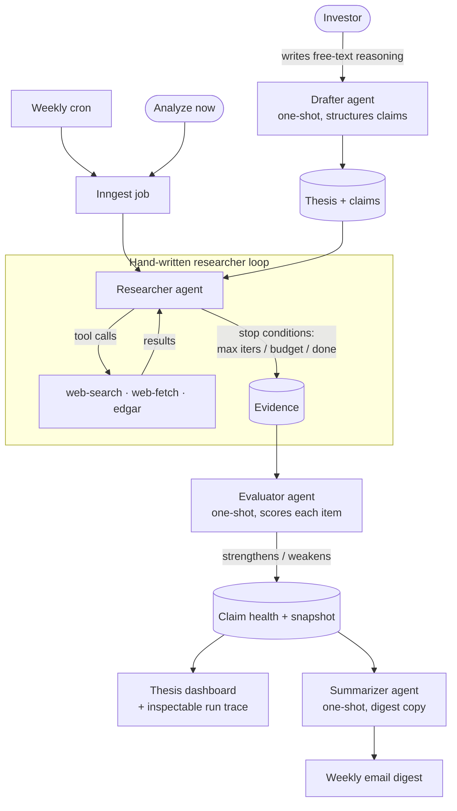

# Thesis Tracker

**Status:** Shipped · v1 complete · [live demo](https://investor-thesis.vercel.app/demo)

**An AI agent that watches the world for evidence that strengthens or weakens your investment thesis.**

You write a thesis — a position you hold plus the falsifiable claims behind it. A hand-written
agent loop then researches the web and SEC filings on a schedule, an evaluator scores each new
piece of evidence against your claims, and a "thesis health" view tracks how the case for your
position evolves over time. Every call the agent makes is inspectable.

It's the agentic counterpart to my earlier project, [Wayfare](https://github.com/thiluxan-s/TravelApp):
where Wayfare's AI is bounded (PDF in → JSON out), this one's AI is a real loop —
plan → tool use → evaluate → repeat → structured output.

## Live demo

**→ [investor-thesis.vercel.app/demo](https://investor-thesis.vercel.app/demo)** — a real NVDA
thesis with a real trail of evidence, agent reasoning, and a health trend. **No sign-up required.**

To create your own thesis, use the [full app](https://investor-thesis.vercel.app) (sign-in via Clerk).

## Architecture



Three (now four) agent roles are kept deliberately separate — different prompts, costs, and
access patterns. The researcher runs a real tool loop; the evaluator, drafter, and summarizer
are one-shot. The loop is hand-written (no framework) so every iteration is stored and replayable
in the UI. See [`docs/ARCHITECTURE.md`](docs/ARCHITECTURE.md) for the full design.

## Design decisions

- **Hand-written agent loop, not LangChain/Mastra.** The loop is the point — I wanted explicit
  stop conditions and a stored, inspectable trace, not a framework abstraction.
- **Separate researcher / evaluator / drafter agents, not one mega-prompt.** Different jobs,
  different costs, different failure modes. Merging them would muddy all three.
- **The drafter structures the user's *own* reasoning** into claims rather than inventing a
  thesis — the tool assists judgement, it doesn't replace it.
- **Forced tool-use for every structured output, validated with Zod.** AI responses are never
  trusted as free-form JSON.
- **pgvector, not a separate vector DB.** Postgres is already there, so the embedding column lives
  beside the data — reserved for similarity dedup, and currently unwritten and unread.
- **Deterministic health math, not AI-scored aggregation.** Claim scores roll up by a fixed
  formula so the trend line is reproducible and explainable.
- **Weekly schedule, not real-time.** Matches how theses actually move and respects free-tier limits.
- **Fixture-backed AI in dev (`USE_AI_FIXTURES=1`).** Agent runs cost real money; dev replays
  cached outputs by default.

## Tech stack

Next.js 16 (App Router, Server Components) · TypeScript (strict) · Tailwind + shadcn/ui ·
Neon Postgres + pgvector + Drizzle ORM · Clerk auth · Anthropic API (native tool use) ·
Inngest (cron + ad-hoc jobs) · Resend + React Email · Zod everywhere · Vitest · Vercel.

## Local development

```bash
git clone https://github.com/thiluxan-s/investor-thesis.git
cd investor-thesis
npm install
cp .env.example .env.local   # fill in the values

npm run db:migrate           # apply the schema to your database
npm run dev                  # http://localhost:3000
```

- Set `USE_AI_FIXTURES=1` in `.env.local` to replay cached AI outputs instead of calling
  the Anthropic API (default for dev — saves tokens).
- Database migrations: `npm run db:migrate`.
- `npm run typecheck` · `npm run lint` · `npm test` (tests require **Node 22**).

## Deployment & seeding the demo

The app deploys to Vercel. After the first deploy, seed the public `/demo` thesis into the
**production** database (otherwise `/demo` 404s):

```bash
USE_AI_FIXTURES=1 DATABASE_URL="<your-prod-database-url>" \
  node --conditions=react-server --env-file=.env.local --import tsx scripts/seed-demo.ts
```

The shell `DATABASE_URL` overrides `--env-file`, so this targets prod while `.env.local`
supplies the other validated env vars. The seed is idempotent — safe to re-run. It only needs
`DATABASE_URL` + `USE_AI_FIXTURES`.

### Known limitation: Clerk runs on development keys

The deployed app authenticates against a Clerk **development** instance, not a production
one. That is a deliberate trade, not an oversight.

Clerk production instances require five DNS records — Frontend API, Account Portal, and
email authentication — on a domain you control. A `*.vercel.app` subdomain cannot host
them, so going to production keys means buying a custom domain first. For a non-commercial
portfolio project that has not been worth it yet.

What it costs, honestly: development instances pass session data via a `__clerk_db_jwt`
querystring rather than a same-site cookie, so session tokens can appear in server logs and
browser history. Clerk is explicit that this is not suitable for production workloads. The
Account Portal also renders on an `accounts.dev` domain, and the instance is capped at 100
users.

What it does not cost: the [`/demo`](https://investor-thesis.vercel.app/demo) path — the one
this project is actually meant to be looked at through — requires no authentication and
never touches Clerk. The exposure is limited to accounts that actually sign up.

Moving to production keys is a domain purchase plus a key swap, a webhook re-registration,
and a redeploy. It is on the list, behind work that changes what the product does.

## Build status

Delivered in phases, each a working, reviewable slice:

- [x] **Phase 1 — Foundation** — Next.js + Clerk + Neon/Drizzle scaffold, typed env, CI basics
- [x] **Phase 2 — Thesis CRUD** — create/edit theses and falsifiable claims
- [x] **Phase 3 — Researcher agent** — hand-written tool loop + inspectable run trace UI
- [x] **Phase 4 — Evaluator & health** — per-claim scoring and thesis-health-over-time
- [x] **Phase 5 — Schedule & digest** — weekly Inngest cron + Resend email summaries
- [x] **Phase 6 — Drafting, demo, polish & ship** — paragraph→claims drafter, public read-only demo, landing page, hardening, and production deploy
- [ ] **Phase 7 — Challenge the thesis** — point the same loop *against* a thesis and have a challenger agent argue the case for why it's wrong. Engine shipped (7a); the per-claim drill-down and challenge trigger are next (7b).

## What I'd build next

- Streaming UX for the drafter (watch claims structure themselves in real time).
- Multi-ticker / basket theses and cross-thesis health.
- Source-credibility weighting in the evaluator.
- Alerts on sharp health drops, not just the weekly digest.
- Backtesting: replay a thesis against historical evidence windows.
