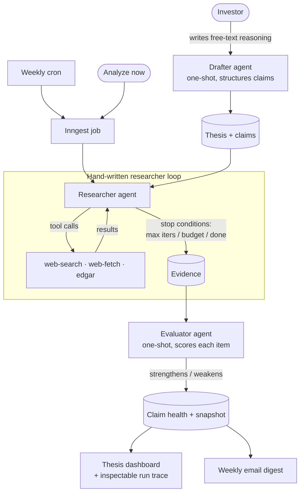

# Phase 6e — Ship Implementation Plan

> **For agentic workers:** REQUIRED SUB-SKILL: Use superpowers:subagent-driven-development (recommended) or superpowers:executing-plans to implement this plan task-by-task. Steps use checkbox (`- [ ]`) syntax for tracking.

**Goal:** Make the repo and live URL present as a finished senior portfolio piece — branded link previews, a branded favicon, accurate metadata, and a rewritten README with an architecture diagram and a prod-seed runbook.

**Architecture:** Pure presentation/docs phase. Two `next/og` `ImageResponse` routes (favicon + OG image) generated at request time (no committed binaries), one metadata edit to the root layout, and a full README rewrite. No new product features, no schema changes, no new dependencies (`next/og` ships with Next 16).

**Tech Stack:** Next.js 16 App Router metadata files (`app/icon.tsx`, `app/opengraph-image.tsx`), `next/og` `ImageResponse`, Markdown + Mermaid (GitHub-rendered).

## Global Constraints

- Strict approval workflow: summarize + show diff + WAIT for explicit approval before any `git add`/`git commit`. Every task commits separately.
- `npm run typecheck` passes and `npm run lint` is clean before every commit.
- No new dependencies (`next/og` is built into Next 16). No `any`.
- Brand tokens (copy verbatim): primary deep blue `#1E3A5F`; health-strong `#1F7A4D`; health-weak `#C0492F`. Brand mark = deep-blue rounded square (matches `app/page.tsx:32` / `app/(app)/layout.tsx:18`).
- Live URL: `https://investor-thesis.vercel.app`. Demo path: `/demo`. "No sign-up required" framing for the demo.
- Never commit the real prod `DATABASE_URL` — README uses `<your-prod-database-url>` placeholder only.
- No demo video, no static screenshots (descoped). README imagery = Mermaid diagram + live link only.

---

### Task 1: Branded favicon

Replace the 25KB default Next boilerplate `app/favicon.ico` with a generated deep-blue rounded-square mark via `app/icon.tsx`, matching the in-app wordmark.

**Files:**
- Create: `app/icon.tsx`
- Delete: `app/favicon.ico`

**Interfaces:**
- Consumes: nothing.
- Produces: a `/icon` route Next auto-wires into `<link rel="icon">`; consumed implicitly by Task 3 (metadata `icons` resolves automatically).

- [ ] **Step 1: Create `app/icon.tsx`**

```tsx
import { ImageResponse } from "next/og";

// Branded favicon: the deep-blue rounded-square mark used in the wordmark
// (app/page.tsx, app/(app)/layout.tsx). Generated at request time — no binary.
export const size = { width: 32, height: 32 };
export const contentType = "image/png";

export default function Icon() {
  return new ImageResponse(
    (
      <div
        style={{
          width: "100%",
          height: "100%",
          display: "flex",
          background: "#1E3A5F",
          borderRadius: 7,
        }}
      />
    ),
    { ...size },
  );
}
```

- [ ] **Step 2: Delete the default favicon**

Run: `git rm app/favicon.ico`
Expected: removes the 25KB Next boilerplate icon so the generated `app/icon.tsx` is served.

- [ ] **Step 3: Verify typecheck + build picks up the route**

Run: `npm run typecheck && npm run lint`
Expected: both pass clean.

Run: `npm run build 2>&1 | grep -i "icon\|error" | head`
Expected: build succeeds; no errors referencing the icon route. (A full `npm run dev` + visiting `/icon` is an acceptable alternative check.)

- [ ] **Step 4: Commit**

```bash
# Step 2's `git rm` already staged the favicon deletion.
git add app/icon.tsx
git commit -m "feat: branded favicon via generated app/icon.tsx"
```

---

### Task 2: OG / link-preview image

A code-generated 1200×630 brand card for social/link previews.

**Files:**
- Create: `app/opengraph-image.tsx`

**Interfaces:**
- Consumes: nothing.
- Produces: an `/opengraph-image` route Next auto-wires into OpenGraph + (as fallback) Twitter card metadata; consumed implicitly by Task 3.

- [ ] **Step 1: Create `app/opengraph-image.tsx`**

```tsx
import { ImageResponse } from "next/og";

export const alt =
  "Thesis Tracker — an AI agent that tracks evidence for and against your investment thesis";
export const size = { width: 1200, height: 630 };
export const contentType = "image/png";

export default function OpengraphImage() {
  return new ImageResponse(
    (
      <div
        style={{
          width: "100%",
          height: "100%",
          display: "flex",
          flexDirection: "column",
          justifyContent: "space-between",
          background: "#ffffff",
          padding: 80,
        }}
      >
        {/* Wordmark */}
        <div style={{ display: "flex", alignItems: "center", gap: 18 }}>
          <div style={{ width: 44, height: 44, background: "#1E3A5F", borderRadius: 12, display: "flex" }} />
          <div style={{ fontSize: 34, fontWeight: 600, color: "#18181b" }}>Thesis Tracker</div>
        </div>

        {/* Headline + tagline */}
        <div style={{ display: "flex", flexDirection: "column", gap: 20 }}>
          <div style={{ fontSize: 64, fontWeight: 700, color: "#18181b", lineHeight: 1.1, letterSpacing: "-0.02em" }}>
            Evidence for and against
            <br />
            your investment thesis.
          </div>
          <div style={{ fontSize: 28, color: "#71717a", maxWidth: 760 }}>
            An AI agent researches the web on a schedule, scores each claim, and tracks thesis health over time.
          </div>
        </div>

        {/* Health-bar motif */}
        <div style={{ display: "flex", alignItems: "center", gap: 14 }}>
          <div style={{ width: 220, height: 10, borderRadius: 999, background: "#1F7A4D" }} />
          <div style={{ width: 120, height: 10, borderRadius: 999, background: "#e4e4e7" }} />
          <div style={{ width: 80, height: 10, borderRadius: 999, background: "#C0492F" }} />
          <div style={{ marginLeft: 16, fontSize: 22, color: "#a1a1aa", fontFamily: "monospace" }}>
            investor-thesis.vercel.app
          </div>
        </div>
      </div>
    ),
    { ...size },
  );
}
```

- [ ] **Step 2: Verify typecheck/lint + render**

Run: `npm run typecheck && npm run lint`
Expected: both pass clean.

Run: `npm run build 2>&1 | grep -i "opengraph\|error" | head`
Expected: build succeeds; `/opengraph-image` route present, no errors. (Alternatively `npm run dev` and open `/opengraph-image` to eyeball the rendered card.)

- [ ] **Step 3: Commit**

```bash
git add app/opengraph-image.tsx
git commit -m "feat: generated OpenGraph link-preview image"
```

---

### Task 3: Metadata

Wire `metadataBase`, `openGraph`, and `twitter` into the root layout so the icon + OG image are referenced with absolute URLs.

**Files:**
- Modify: `app/layout.tsx:8-12` (the `metadata` export)

**Interfaces:**
- Consumes: the `app/icon.tsx` and `app/opengraph-image.tsx` routes from Tasks 1–2 (resolved automatically by Next — no manual `icons`/`openGraph.images` entries needed for the generated routes).
- Produces: nothing downstream.

- [ ] **Step 1: Replace the `metadata` export in `app/layout.tsx`**

Replace:

```tsx
export const metadata: Metadata = {
  title: "Thesis Tracker",
  description:
    "An AI agent that watches the world for evidence that strengthens or weakens your investment thesis.",
};
```

with:

```tsx
const DESCRIPTION =
  "An AI agent that watches the world for evidence that strengthens or weakens your investment thesis.";

export const metadata: Metadata = {
  metadataBase: new URL("https://investor-thesis.vercel.app"),
  title: "Thesis Tracker",
  description: DESCRIPTION,
  openGraph: {
    type: "website",
    siteName: "Thesis Tracker",
    title: "Thesis Tracker",
    description: DESCRIPTION,
    url: "https://investor-thesis.vercel.app",
  },
  twitter: {
    card: "summary_large_image",
    title: "Thesis Tracker",
    description: DESCRIPTION,
  },
};
```

- [ ] **Step 2: Verify typecheck/lint**

Run: `npm run typecheck && npm run lint`
Expected: both pass clean.

Run: `npm run build 2>&1 | grep -i error | head`
Expected: no errors. (Optional: `npm run dev`, view source on `/`, confirm `og:image`/`twitter:image` point at `https://investor-thesis.vercel.app/opengraph-image...` and `og:url`/`metadataBase` are absolute.)

- [ ] **Step 3: Commit**

```bash
git add app/layout.tsx
git commit -m "feat: openGraph + twitter metadata with metadataBase"
```

---

### Task 4: README rewrite

Replace the stale Phase-1 README with the portfolio-grade version: live demo link, Mermaid architecture diagram, design decisions, tech stack, local dev, deployment/seed runbook, and a v2 roadmap.

**Files:**
- Modify: `README.md` (full rewrite)

**Interfaces:**
- Consumes: live URL + seed command (from spec). No code dependency.
- Produces: nothing downstream.

- [ ] **Step 1: Overwrite `README.md` with the content below**

````markdown
# Thesis Tracker

**An AI agent that watches the world for evidence that strengthens or weakens your investment thesis.**

You write a thesis — a position you hold plus the falsifiable claims behind it. A hand-written
agent loop then researches the web and SEC filings on a schedule, an evaluator scores each new
piece of evidence against your claims, and a "thesis health" view tracks how the case for your
position evolves over time. Every call the agent makes is inspectable.

It's the agentic counterpart to my earlier project, [Wayfare](https://github.com/thiluxan-s/TravelApp):
where Wayfare's AI is bounded (PDF in → JSON out), this one's AI is a real loop —
plan → tool use → evaluate → repeat → structured output.

## Live demo

**→ [investor-thesis.vercel.app/demo](https://investor-thesis.vercel.app/demo)** — a real NVDA
thesis with a real trail of evidence, agent reasoning, and a health trend. **No sign-up required.**

To create your own thesis, use the [full app](https://investor-thesis.vercel.app) (sign-in via Clerk).

## Architecture



Three (now four) agent roles are kept deliberately separate — different prompts, costs, and
access patterns. The researcher runs a real tool loop; the evaluator, drafter, and summarizer
are one-shot. The loop is hand-written (no framework) so every iteration is stored and replayable
in the UI. See [`docs/ARCHITECTURE.md`](docs/ARCHITECTURE.md) for the full design.

## Design decisions

- **Hand-written agent loop, not LangChain/Mastra.** The loop is the point — I wanted explicit
  stop conditions and a stored, inspectable trace, not a framework abstraction.
- **Separate researcher / evaluator / drafter agents, not one mega-prompt.** Different jobs,
  different costs, different failure modes. Merging them would muddy all three.
- **The drafter structures the user's *own* reasoning** into claims rather than inventing a
  thesis — the tool assists judgement, it doesn't replace it.
- **Forced tool-use for every structured output, validated with Zod.** AI responses are never
  trusted as free-form JSON.
- **pgvector, not a separate vector DB.** Postgres already there; embeddings live beside the data.
- **Deterministic health math, not AI-scored aggregation.** Claim scores roll up by a fixed
  formula so the trend line is reproducible and explainable.
- **Weekly schedule, not real-time.** Matches how theses actually move and respects free-tier limits.
- **Fixture-backed AI in dev (`USE_AI_FIXTURES=1`).** Agent runs cost real money; dev replays
  cached outputs by default.

## Tech stack

Next.js 16 (App Router, Server Components) · TypeScript (strict) · Tailwind + shadcn/ui ·
Neon Postgres + pgvector + Drizzle ORM · Clerk auth · Anthropic API (native tool use) ·
Inngest (cron + ad-hoc jobs) · Resend + React Email · Zod everywhere · Vitest · Vercel.

## Local development

```bash
git clone https://github.com/thiluxan-s/InvestorThesis.git
cd InvestorThesis
npm install
cp .env.example .env.local   # fill in the values

npm run dev                  # http://localhost:3000
```

- Set `USE_AI_FIXTURES=1` in `.env.local` to replay cached AI outputs instead of calling
  the Anthropic API (default for dev — saves tokens).
- Database migrations: `npx drizzle-kit migrate`.
- `npm run typecheck` · `npm run lint` · `npm test` (tests require **Node 22**).

## Deployment & seeding the demo

The app deploys to Vercel. After the first deploy, seed the public `/demo` thesis into the
**production** database (otherwise `/demo` 404s):

```bash
USE_AI_FIXTURES=1 DATABASE_URL="<your-prod-database-url>" \
  node --conditions=react-server --env-file=.env.local --import tsx scripts/seed-demo.ts
```

The shell `DATABASE_URL` overrides `--env-file`, so this targets prod while `.env.local`
supplies the other validated env vars. The seed is idempotent — safe to re-run. It only needs
`DATABASE_URL` + `USE_AI_FIXTURES`.

## What I'd build next

- Streaming UX for the drafter (watch claims structure themselves in real time).
- Multi-ticker / basket theses and cross-thesis health.
- Source-credibility weighting in the evaluator.
- Alerts on sharp health drops, not just the weekly digest.
- Backtesting: replay a thesis against historical evidence windows.
````

- [ ] **Step 2: Verify the Mermaid block and links**

Run: `grep -n "investor-thesis.vercel.app\|mermaid\|Phase 1" README.md`
Expected: live URL present; ` ```mermaid ` fence present; **no** "Phase 1 — Foundation (current)" stale text remaining.

(Optional: paste the Mermaid block into the GitHub Markdown preview or mermaid.live to confirm it renders.)

- [ ] **Step 3: Commit**

```bash
git add README.md
git commit -m "docs: rewrite README with architecture diagram, design decisions, and deploy runbook"
```

---

## Notes for the executor

- These tasks are independent and may be reviewed/committed in any order, but Task 3 (metadata)
  reads best reviewed after Tasks 1–2 exist so the referenced routes are present.
- No unit tests in this phase — deliverables are static content and image routes. Verification
  is typecheck + lint + build (+ optional visual eyeball of `/icon` and `/opengraph-image`).
- After all four tasks land and are approved, this completes Phase 6e. The user then runs the
  prod-seed command and verifies `/demo` + the OG preview live (manual, outside this repo).
